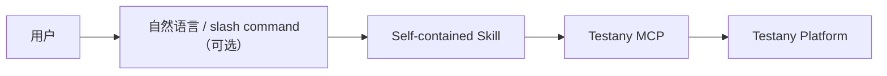

# Testany Bot - 通用版

Testany 测试平台智能助手，支持测试用例管理、流水线编排、执行监控、故障诊断、CI/CD 集成。

## 兼容性

通用版的含义是：**Skill 格式、MCP workflow 和领域知识可跨平台复用**；宿主是否提供结构化提问、slash command 等交互增强能力，则取决于具体平台。

| 能力层 | 兼容性说明 |
|--------|-----------|
| Skill 发现与加载 | ✅ 遵循 [Agent Skills 公共规范](https://agentskills.io)，使用标准 `name` / `description` 字段 |
| MCP 工具调用 | ✅ 只要宿主支持 MCP，即可执行核心 Testany workflow |
| 结构化提问工具（如 AskUserQuestion） | 可选增强，视宿主能力而定 |
| Slash command / router | 可选增强，视宿主能力而定 |

已验证可复用 `testany-bot` workflow 的宿主包括 Claude Code、VS Code Copilot、GitHub Copilot；其中 Claude Code 对结构化提问和 slash command 的支持更完整。

## 前置要求

- Testany MCP Server 已配置并运行
- 已获取 Testany 平台访问权限

## 目录结构

```
testany-bot/
├── .claude-plugin/
│   └── plugin.json
├── commands/              # 命令入口（提供 /command 补全）
│   ├── case.md
│   ├── case-writing.md
│   ├── pipeline.md
│   ├── tests.md
│   ├── debug.md
│   ├── trigger.md
│   └── workspace.md
└── skills/                # 技能定义（自包含知识）
    ├── testany-guide/     # 参考知识库
    │   ├── SKILL.md
    │   └── references/
    │       ├── concepts.md
    │       ├── executors.md
    │       └── pipeline-yaml.md
    ├── testany-case/SKILL.md
    ├── testany-case-writing/SKILL.md
    ├── testany-pipeline/SKILL.md
    ├── testany-tests/SKILL.md
    ├── testany-debug/SKILL.md
    ├── testany-trigger/SKILL.md
    └── testany-workspace/SKILL.md
```

## 技能列表

| 技能 | 描述 | 主要操作 |
|------|------|---------|
| **testany-case** | 测试用例管理 | 创建、配置、更新用例，上传脚本 |
| **testany-case-writing** | 测试脚本编写 | 根据需求生成测试用例文档和脚本 |
| **testany-pipeline** | 流水线编排 | 创建 Pipeline，配置依赖和 Relay |
| **testany-tests** | 测试执行 | 触发 Pipeline 执行，监控状态 |
| **testany-debug** | 故障诊断 | 分析失败原因，查看日志 |
| **testany-trigger** | 测试触发 | 创建门禁、定时计划，提供集成代码 |
| **testany-workspace** | 工作空间管理 | 成员管理、权限配置 |
| **testany-guide** | 参考知识 | 核心概念、Executor 配置、YAML 语法 |

## 使用方式

### 命令触发（宿主支持 slash command 时）

```
/case 上传这个测试脚本到 Testany
/case-writing 写一个测试用户登录 API 的 Python 测试
/pipeline 把登录和查询用例组成流水线
/tests Y2K-0601
/debug Y2K-0601-00001
/trigger 创建质量门禁
/workspace 添加成员
```

### 自然语言

```
帮我创建一个 Postman 测试用例
执行回归测试流水线
这个测试为什么失败了？
```

如果宿主不支持 slash command，直接使用自然语言触发对应 workflow 即可。

## 架构特点

**自包含技能架构**：每个技能文件包含完整的知识和工作流程，无需依赖外部 Subagent。



优点：
- Skill 格式与 MCP workflow 跨平台复用
- 交互原语按宿主能力适配
- 简单直接
- 无需复杂调度

## 安全说明

### 日志获取安全验证

使用 `testany_log_sign` 获取日志时，返回的 `curlCommand` 需要验证：

1. **域名验证**：仅允许 `*.testany.io` / `*.testany.com.cn`
2. **协议验证**：仅允许 HTTPS
3. **参数验证**：禁止危险参数（`-o`, `|`, `;`, `$(`）

## 注意事项

1. **Pipeline 执行**：Testany 只支持执行 Pipeline，不支持直接执行单个 Case
2. **Relay 配置**：配置变量传递前需验证源/目标 Case 的环境变量类型
3. **Runtime 选择**：推荐使用 `cloudprime` runtime

## 与 Claude Code 专用版的区别

| 特性 | 通用版 (testany-bot) | Claude 专用版 (testany-bot-for-claude) |
|------|---------------------|---------------------------------------|
| 架构 | 自包含 Skills | Subagent + Router |
| Context 隔离 | ❌ | ✅ |
| 兼容性 | Skill 格式 + MCP workflow 跨平台 | 仅 Claude Code |
| Frontmatter | 仅 name/description | 含 context/agent 等专用字段 |

如果您使用 Claude Code，推荐使用 [testany-bot-for-claude](../testany-bot-for-claude) 以获得更好的 Context 管理和专业化体验。

## 许可证

MIT License

## 相关链接

- [Testany 官方文档](https://docs.testany.io)
- [Testany MCP](https://github.com/TestAny-io/testany-mcp)
- [Agent Skills 规范](https://agentskills.io)
