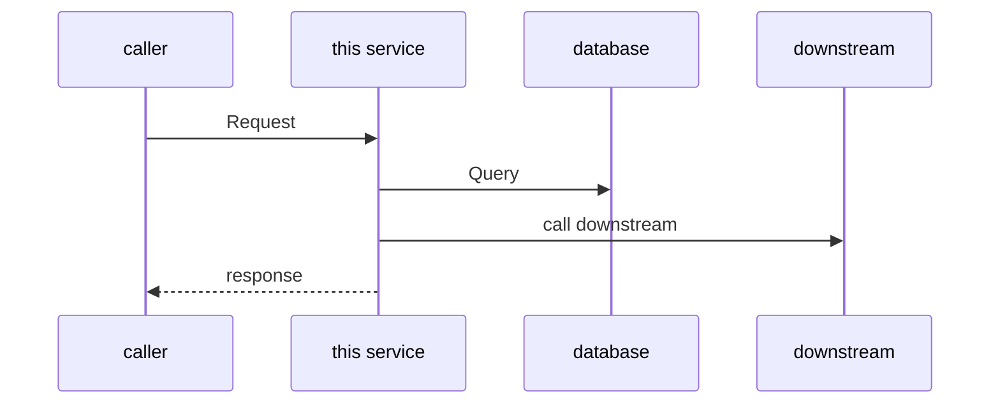

# HLD Template: New Features (Pure Backend)

> The following is the template content, copy it and fill it in according to the actual situation.

---

#[Function name] Technical design document

## Meta information

| Project | Content |
|------|------|
| Associated PRD | [PRD document link] |
| Version | v1.0 |
| Author | [Author] |
| Status | Draft/Under Review/Approved |

## PRD↔HLD requirements mapping table

**Coverage of this HLD**: [Scope] (required for 1:N scenario)
**Index document**: [HLD-INDEX-xxx.md] (path) (required for 1:N scenario)

| PRD Entry | Acceptance Criteria | HLD Chapter | Status |
|----------|---------|---------|------|
| [FR-XXX] | [Acceptance Criteria] | [Corresponding Chapter] | ✓/In Progress/To Be Determined |

## 1. Background and goals

### 1.1 Business Background
[Brief description, citing PRD]

### 1.2 Technical Objectives
- [Target 1]
- [Target 2]

### 1.3 Non-functional goals
| Indicators | Target values ​​|
|------|--------|
| Throughput | X QPS |
| Delay P99 | < Xms |
| Availability | X% |

### 1.4 Technical status and changes (such as adding new functions to existing systems)

#### Affected technology components
| Component | Current Status | Changes |
|------|----------|---------|
| [Component] | [Current] | [Change] |

#### Overview of architectural changes
[Describe the impact on the existing architecture. If it is a new system, it can be marked "not applicable"]

## 2. Technical architecture

### 2.1 System architecture

```mermaid
graph LR
A[upstream service] --> B[this service]
B --> C[(database)]
B --> D[(cache)]
B --> E[Downstream service]
B --> F [message queue]
```

### 2.2 Reuse inventory

| Capability requirements | Candidate solutions | Assessment conclusions | Sources |
|---------|---------|---------|------|
| [Capability 1] | Internal module A / Third party B / Self-developed | [Selection and reason] | [Document/code path] |
| [Capability 2] | Shared Services

> Description:
> - Prioritize the reuse of internal modules/shared services/third-party mature solutions, and sufficient reasons must be given for self-research
> - **"Source" column is required**: You must indicate which document or code the candidate solution was identified from, and unfounded guessing is prohibited.

### 2.3 Technology Selection

| Components | Selection | Reasons |
|------|------|------|
| Language/Framework | [Selection] | [Reason] |
| Database | [Selection] | [Reason] |
| Cache | [Selection] | [Reason] |
| Message Queuing | [Selection] | [Reason] |

## 3. API design

> **Note**: If the project already has an OpenAPI/Swagger specification, give priority to citing the existing specification path to avoid repeated maintenance.
> - Existing specifications: fill in "For details, see `path/to/openapi.yaml#/paths/xxx`"
> - New interface: fill in the details according to the template below

### 3.1 Interface list

| Interface | Method | Path | Caller | Canonical location |
|------|------|------|--------|----------|
| [Interface 1] | POST | /api/v1/xxx | [Caller] | New / For details, see `openapi.yaml#L100` |

### 3.2 Interface details

> Only fill in the details for **new interface**. For existing standardized interfaces, please refer to the canonical path.

#### POST /api/v1/xxx (new)

**Request body**:
```json
{
  "field1": "string"
}
```

**Response body**:
```json
{
  "code": 0,
  "data": {}
}
```

**Error code**:
| Error code | Description |
|--------|------|
| 10001 | [Description] |

## 4. Data design

### 4.1 Data Model (Conceptual Level)

| Entity | Description | Core Properties (Concept) |
|------|------|-----------------|
| [Entity] | [Description] | Identity, name, timestamp, etc. |

> Note: This is a conceptual model, the specific field types, lengths, etc. belong to LLD

### 4.2 Index strategy
| Entities | Indexing Strategy | Purpose |
|------|---------|------|
| [entity] | [policy description] | [purpose] |

### 4.3 Data life cycle
[Data retention policy, archiving policy]

## 5. Key processes

### 5.1 [Process Name]



### 5.2 Exception handling
| Abnormal Scenarios | Handling Strategies |
|---------|---------|
| database timeout | [policy] |
| Downstream Failure | [Strategy] |

## 6. Non-functional design

### 6.1 Performance Strategy
- Cache: [Policy]
- Batch Processing: [Strategy]
- Asynchronous processing: [Strategy]

### 6.2 Reliability Strategy
- Idempotent design: [Strategy]
- Retry mechanism: [Strategy]
- Circuit breaker downgrade: [Strategy]

### 6.3 Observability
- Key indicators: [Indicator list]
- Alarm rules: [Rules]

## 7. Deployment and operation and maintenance

### 7.1 Deployment architecture
[Deployment method, number of instances]

### 7.2 Configuration Management
[Configuration center, environment differences]

### 7.3 Compatibility design (accepting PRD compatibility requirements)

| PRD compatibility requirements | Technical implementation solutions |
|---------------|-------------|
| [Interface Compatibility] | [Technical Solution] |
| [Data Compatibility] | [Technical Solution] |

### 7.4 Release Strategy

| Strategy | Design |
|------|------|
| Grayscale scheme | [Grayscale range, grayscale conditions] |
| Function switch | [Switch design, if required] |
| Rollback plan | [Rollback steps, rollback conditions] |

### 7.5 Buried points/monitoring design (accepting PRD success indicators)

| PRD success indicators | Hiding/monitoring design |
|-------------|--------------|
| [Indicator name] | [Collection method, storage, display] |

## 8. Risks and Dependencies

| Risks/Dependencies | Description | Mitigation |
|----------|------|---------|
| [Project] | [Description] | [Measure] |
