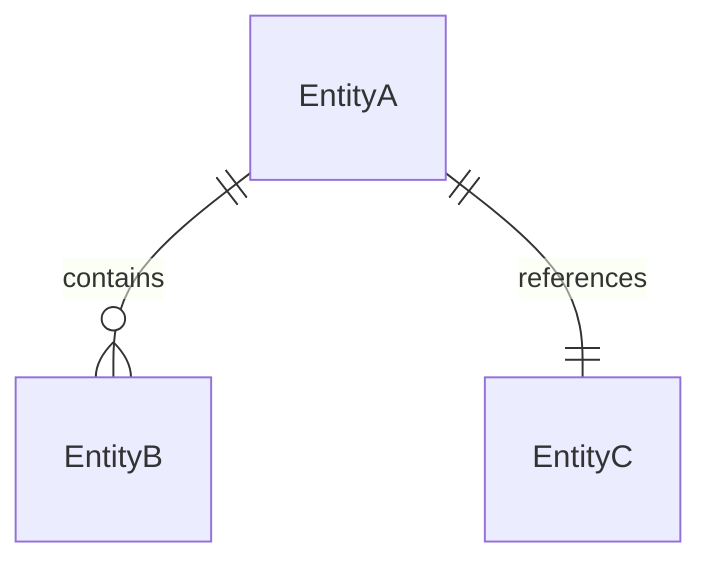
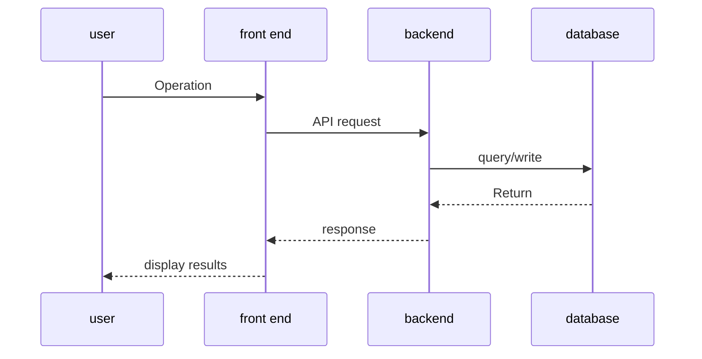

# HLD Template: new features (with UI)

> The following is the template content, copy it and fill it in according to the actual situation.

---

#[Function name] Technical design document

## Meta information

| Project | Content |
|------|------|
| Associated PRD | [PRD document link] |
| Version | v1.0 |
| Author | [Author] |
| creation date | [date] |
| Status | Draft/Under Review/Approved |

## PRD↔HLD requirements mapping table

**Coverage of this HLD**: [Scope] (required for 1:N scenario)
**Index document**: [HLD-INDEX-xxx.md] (path) (required for 1:N scenario)

| PRD Entry | Acceptance Criteria | HLD Chapter | Status |
|----------|---------|---------|------|
| [FR-XXX] | [Acceptance Criteria] | [Corresponding Chapter] | ✓/In Progress/To Be Determined |

## 1. Background and goals

### 1.1 Business Background
[Brief description of business background, citing PRD]

### 1.2 Technical Objectives
- [Technical Objective 1]
- [Technical Objective 2]

### 1.3 Non-functional goals
| Indicator | Target value | Source |
|------|--------|------|
| Response time | < Xms | PRD constraints |
| Concurrency | X QPS | PRD Constraints |

### 1.4 Technical status and changes (such as adding new functions to existing systems)

#### Affected technology components
| Component | Current Status | Changes |
|------|----------|---------|
| [Component] | [Current] | [Change] |

#### Overview of architectural changes
[Describe the impact on the existing architecture. If it is a new system, it can be marked "not applicable"]

## 2. Technical architecture

### 2.1 Overall architecture

```mermaid
graph TB
subgraph front end
        A[Web App] --> B[API Gateway]
    end
subgraph backend
        B --> C[Service A]
        B --> D[Service B]
        C --> E[(Database)]
    end
```

### 2.2 Reuse inventory

| Capability requirements | Candidate solutions | Assessment conclusions | Sources |
|---------|---------|---------|------|
| [Capability 1] | Internal module A / Third party B / Self-developed | [Selection and reason] | [Document/code path] |
| [Capability 2] | Shared Services

> Description:
> - Prioritize the reuse of internal modules/shared services/third-party mature solutions, and sufficient reasons must be given for self-research
> - **"Source" column is required**: You must indicate which document or code the candidate solution was identified from, and unfounded guessing is prohibited.

### 2.3 Technology Selection

| Components | Selection | Reasons |
|------|------|------|
| Front-end framework | [Selection] | [Reason] |
| Backend framework | [Selection] | [Reason] |
| Database | [Selection] | [Reason] |
| Cache | [Selection] | [Reason] |

## 3. Front-end design

### 3.1 Page structure
[Page level, routing design]

### 3.2 Status Management
[State Management Strategy]

### 3.3 Interacting with the backend
[API calling method, error handling strategy]

## 4. API design

> **Note**: If the project already has an OpenAPI/Swagger specification, give priority to citing the existing specification path to avoid repeated maintenance.
> - Existing specifications: fill in "For details, see `path/to/openapi.yaml#/paths/xxx`"
> - New interface: fill in the details according to the template below

### 4.1 Interface list

| Interface | Method | Path | Description | Canonical location |
|------|------|------|------|----------|
| [Interface 1] | POST | /api/v1/xxx | [Description] | New / For details, see `openapi.yaml#L100` |
| [Interface 2] | GET | /api/v1/xxx | [Description] | New / For details, see `openapi.yaml#L150` |

### 4.2 Authentication and authorization
[Authentication method, authority control strategy]

### 4.3 Interface details

> Only fill in the details for **new interface**. For existing standardized interfaces, please refer to the canonical path.

#### POST /api/v1/xxx (new)

**Request body**:
```json
{
  "field1": "string",
  "field2": "number"
}
```

**Response body**:
```json
{
  "code": 0,
  "data": {}
}
```

## 5. Data design

### 5.1 Data model (conceptual level)



| Entity | Description | Core Properties (Concept) |
|------|------|-----------------|
| EntityA | [Entity Description] | ID, name, creation time |
| EntityB | [Entity Description] | ID, Association A, Status |

> Note: This is a conceptual model, the specific field types, lengths, etc. belong to LLD

### 5.2 Index strategy
| Entities | Indexing Strategy | Purpose |
|------|---------|------|
| [entity] | [policy description] | [purpose] |

### 5.3 Data migration strategy
[Whether migration is needed and migration strategy]

## 6. Key processes

### 6.1 [Core process name]



## 7. Non-functional design

### 7.1 Performance Strategy
- Cache policy: [policy description]
- Pagination strategy: [strategy description]

### 7.2 Security Policy
- Authentication: [Policy]
- Data desensitization: [Strategy]

### 7.3 Observability
- Log: [Strategy]
- Monitor: [Key Indicators]
- Alarm: [Alarm Rules]

## 8. Deployment architecture

### 8.1 Deployment topology
[Deployment diagram or description]

### 8.2 Environment configuration
| Environment | Configuration differences |
|------|---------|
| Development | [Configuration] |
| Test | [Configuration] |
| Production | [Configuration] |

### 8.3 Compatibility design (accepting PRD compatibility requirements)

| PRD compatibility requirements | Technical implementation solutions |
|---------------|-------------|
| [Old version client compatibility] | [Technical solution] |
| [Compatible with existing data] | [Technical solution] |

### 8.4 Release Strategy

| Strategy | Design |
|------|------|
| Grayscale scheme | [Grayscale range, grayscale conditions] |
| Function switch | [Switch design, if required] |
| Rollback plan | [Rollback steps, rollback conditions] |

### 8.5 Buried points/monitoring design (accepting PRD success indicators)

| PRD success indicators | Hiding/monitoring design |
|-------------|--------------|
| [Indicator name] | [Collection method, storage, display] |

## 9. Risks and Dependencies

### 9.1 Technical Risks
| Risk | Impact | Mitigation |
|------|------|---------|
| [Risk] | [Impact] | [Measures] |

### 9.2 External dependencies
| Dependencies | Responsible Team | Status |
|------|---------|------|
| [Dependencies] | [Team] | [Status] |

## 10. Milestones

| Stages | Deliverables | Responsible Person |
|------|--------|--------|
| Phase 1 | [Deliverables] | [Responsible Person] |
