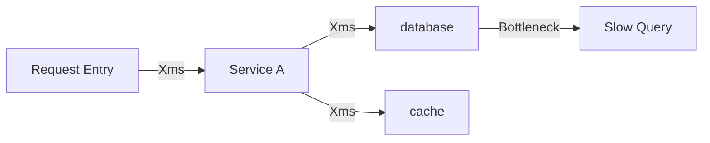

# HLD Template: Performance/Security Optimization

> The following is the template content, copy it and fill it in according to the actual situation.

---

# [Optimization Project] Technical Design Document

## Meta information

| Project | Content |
|------|------|
| Associated PRD | [PRD document link] |
| Optimization Type | Performance/Security/Availability/Cost |
| Version | v1.0 |
| Author | [Author] |

## PRD↔HLD requirements mapping table

| PRD Entry | Acceptance Criteria | HLD Chapter | Status |
|----------|---------|---------|------|
| [NFR-XXX] | [Acceptance Criteria] | [Corresponding Chapter] | ✓/In Progress/To Be Determined |

## 1. Optimize background

### 1.1 Current situation analysis
| Indicators | Current Values ​​| Questions |
|------|--------|------|
| [Indicator] | [Current Value] | [Problem Description] |

### 1.2 Optimization goals
| Indicator | Current value | Target value | Improvement |
|------|--------|--------|---------|
| [Indicator] | [Current] | [Target] | X% |

### 1.3 Constraints
- [Constraint 1: If the API contract cannot be changed]
- [Constraint 2: such as budget constraints]

## 2. Problem location

### 2.1 Performance bottleneck analysis (applicable to performance optimization)



| Bottleneck point | Time-consuming proportion | Reason |
|--------|---------|------|
| [Bottleneck] | X% | [Reason] |

### 2.2 Security risk analysis (security optimization applies)
| Risk points | Risk level | Potential impact |
|--------|---------|---------|
| [Risk] | High/Medium/Low | [Impact] |

### 2.3 Root cause analysis
[Root cause of problem]

## 3. Optimization plan

### 3.1 Solution Overview

| Optimization points | Optimization strategies | Expected returns |
|--------|---------|---------|
| [Optimization point 1] | [Strategy] | [Income] |

### 3.2 Reuse inventory

| Optimization capability | Candidate solutions | Evaluation conclusion | Source |
|---------|---------|---------|------|
| [Capability 1] | Enhancement of existing components / third-party solutions / self-research | [Selection and reasons] | [Document/code path] |

> Description:
> - Optimization solutions give priority to existing component enhancements and mature third-party solutions
> - **"Source" column is required**: You must indicate which document or code the candidate solution was identified from, and unfounded guessing is prohibited.

### 3.3 Plan details

#### Optimization point 1: [name]

**status quo**:
[Current implementation]

**Optimization Strategy**:
[Optimized implementation]

**Architectural changes**:
```mermaid
graph LR
subgraph before optimization
A1[component] --> B1[slow path]
    end
After subgraph optimization
A2[component] --> C2[cache]
C2 -.miss.-> B2[original path]
    end
```

**Technical Selection**:
| Options | Advantages | Disadvantages | Choices |
|------|------|------|------|
| Option A | [Advantages] | [Disadvantages] | ✓/✗ |
| Option B | [Advantages] | [Disadvantages] | ✓/✗ |

**Reason for selection**:
[Why choose this option]

### 3.3 Solutions not to be adopted
| Plan | Reasons for not adopting |
|------|-----------|
| [Plan] | [Reason] |

## 4. Scope of influence

### 4.1 Scope of code changes
| Modules | Change Types | Impact Assessment |
|------|---------|---------|
| [Module] | Add/Modify/Delete | [Impact] |

### 4.2 Dependency changes
| Dependencies | Changes |
|------|------|
| [Dependencies] | [Changes] |

### 4.3 Configuration changes
| Configuration items | Before change | After change |
|--------|--------|--------|
| [Configuration] | [Front] | [Rear] |

## 5. Verification strategy

### 5.1 Performance verification (performance optimization applies)
| Test Scenario | Test Method | Pass Criteria |
|---------|---------|---------|
| [Scenario] | [Method] | [Standard] |

### 5.2 Security verification (security optimization applies)
| Verification items | Verification methods | Passing standards |
|--------|---------|---------|
| [Verification Item] | [Method] | [Standard] |

### 5.3 Regression testing
[Make sure not to introduce new problems]

## 6. Risks and Mitigations

| Risk | Probability | Impact | Mitigation |
|------|------|------|---------|
| Performance drops after optimization | [Probability] | [Impact] | AB test |
| Introducing new bugs | [Probability] | [Impact] | Full testing |

## 7. Monitoring and Alarming

### 7.1 New monitoring
| Indicator | Description | Alarm threshold |
|------|------|---------|
| [Indicator] | [Description] | [Threshold] |

### 7.2 Observation period indicators
[Key indicators to observe after going online]

### 7.3 Buried points/monitoring design (accepting PRD success indicators)

| PRD success indicators | Hiding/monitoring design |
|-------------|--------------|
| [Indicator name] | [Collection method, storage, display] |

## 8. Online plan

### 8.1 Grayscale strategy
| Stage | Gray scale range | Observation indicators | Duration |
|------|---------|---------|---------|
| [Phase] | [Scope] | [Indicator] | [Time] |

### 8.2 Switch control
| switch | function | default value |
|------|------|--------|
| [Switch] | [Function] | [Value] |

### 8.3 Rollback plan
[Rollback steps]

## 9. Subsequent optimization

### 9.1 Not doing it this time
| Optimization points | Reasons | Follow-up plans |
|--------|------|---------|
| [Optimization] | [Reason] | [Plan] |

### 9.2 Long-term planning
[Long-term optimization direction]
