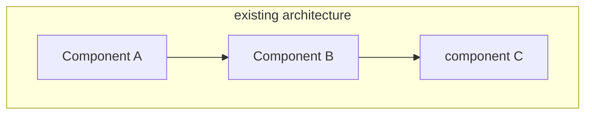
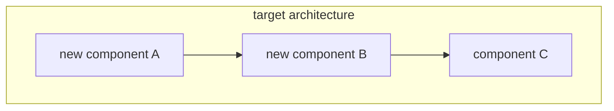

# HLD Template: Refactoring plan

> The following is the template content, copy it and fill it in according to the actual situation.

---

# [Refactoring Project] Technical Design Document

## Meta information

| Project | Content |
|------|------|
| Associated PRD | [PRD document link] |
| Version | v1.0 |
| Author | [Author] |
| Scope of Impact | [Service/Module List] |

## PRD↔HLD requirements mapping table

| PRD Entry | Acceptance Criteria | HLD Chapter | Status |
|----------|---------|---------|------|
| [FR-XXX] | [Acceptance Criteria] | [Corresponding Chapter] | ✓/In Progress/To Be Determined |

## 1. Reconstruct background

### 1.1 Current situation issues
| Problem | Impact | Severity |
|------|------|---------|
| [Question 1] | [Impact] | High/Medium/Low |

### 1.2 Refactoring goals
- [Target 1]
- [Target 2]

### 1.3 Non-target (clearly not done)
- [Non-Target 1]

### 1.4 Success Indicators
| Indicator | Current value | Target value |
|------|--------|--------|
| [Indicator] | [Current] | [Target] |

## 2. Analysis of existing architecture

### 2.1 Existing architecture diagram



### 2.2 Problem location
[Which components/modules need to be refactored and why]

### 2.3 Dependency analysis
| Dependent Component | Relying Party | Impact Assessment |
|-----------|--------|---------|
| [Component] | [Relying Party] | [Impact] |

## 3. Target architecture

### 3.1 Target architecture diagram



### 3.2 Reuse inventory

| Capability requirements | Candidate solutions | Assessment conclusions | Sources |
|---------|---------|---------|------|
| [Capability 1] | Internal module A / Third party B / Self-developed | [Selection and reason] | [Document/code path] |

> Description:
> - During the reconstruction process, give priority to reusing existing modules to avoid reinventing the wheel.
> - **"Source" column is required**: You must indicate which document or code the candidate solution was identified from, and unfounded guessing is prohibited.

### 3.3 Architecture change description
| Change point | Before change | After change | Reason |
|--------|--------|--------|------|
| [Change] | [Before] | [After] | [Reason] |

### 3.4 Changes in technology selection
| Components | Before Change | After Change | Reason |
|------|--------|--------|------|
| [Component] | [Before] | [After] | [Reason] |

## 4. Migration strategy

### 4.1 Migration method
- [ ] Big bang (one-time switch)
- [ ] Progressive (gradual migration)
- [ ] Strangler mode (old and new in parallel)

### 4.2 Migration steps

```mermaid
graph LR
A[Phase 1: Preparation] --> B[Phase 2: Double writing]
B --> C [Stage 3: Cutting Reading]
C --> D[Phase 4: Stop writing]
D --> E[Phase 5: Cleanup]
```

| Phase | Content | Rollback Point |
|------|------|--------|
| Phase 1 | [Content] | [Rollback Method] |

### 4.3 Data migration
[Data migration strategy, consistency guarantee]

## 5. Compatibility design

### 5.1 API compatible
| Interface | Compatibility Policy |
|------|---------|
| [Interface] | [Policy] |

### 5.2 Data Compatibility
[Compatible with old and new data formats]

### 5.3 Configuration compatibility
[Configuration changes, switch control]

## 6. Risks and Mitigations

### 6.1 Technical Risks
| Risk | Probability | Impact | Mitigation |
|------|------|------|---------|
| [Risk] | High/Medium/Low | [Impact] | [Measures] |

### 6.2 Business Risks
| Risk | Impact | Mitigation |
|------|------|---------|
| Service outage | [Impact] | [Action] |

## 7. Rollback plan

### 7.1 Rollback trigger conditions
- [Condition 1]
- [Condition 2]

### 7.2 Rollback steps
1. [Step 1]
2. [Step 2]

### 7.3 Rollback verification
[How to verify rollback success]

## 8. Testing strategy

### 8.1 Test scope
| Test Type | Coverage |
|---------|---------|
| unit testing | [scope] |
| integration testing | [scope] |
| Performance Test | [Scope] |

### 8.2 Comparison test
[Comparative verification strategy between old and new systems]

## 9. Online plan

### 9.1 Grayscale strategy
| Stage | Gray scale | Duration | Observation indicators |
|------|---------|---------|---------|
| [Phase] | X% | X days | [Indicator] |

### 9.2 Monitoring enhancement
[Additional monitoring measures during refactoring]

### 9.3 Buried points/monitoring design (accepting PRD success indicators)

| PRD success indicators | Hiding/monitoring design |
|-------------|--------------|
| [Indicator name] | [Collection method, storage, display] |

## 10. Cleanup plan

### 10.1 Deprecated components
| Components | Planned offline time | Dependency check |
|------|-------------|---------|
| [component] | [time] | [check] |

### 10.2 Technical Debt Cleanup
[Legacy Technical Debt Treatment Plan]
