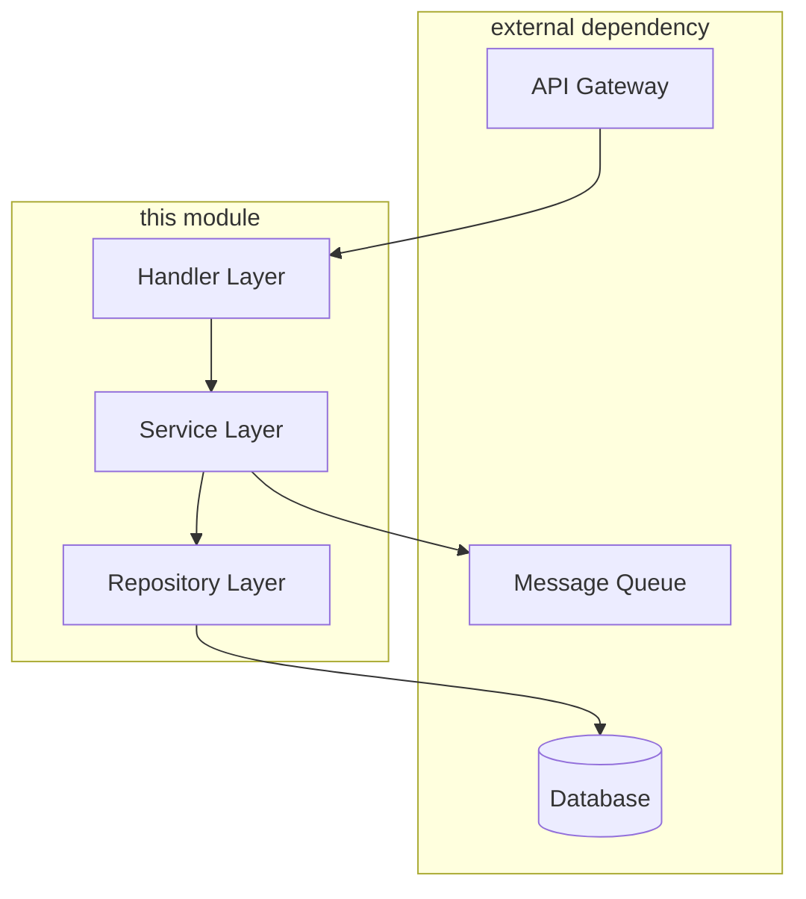
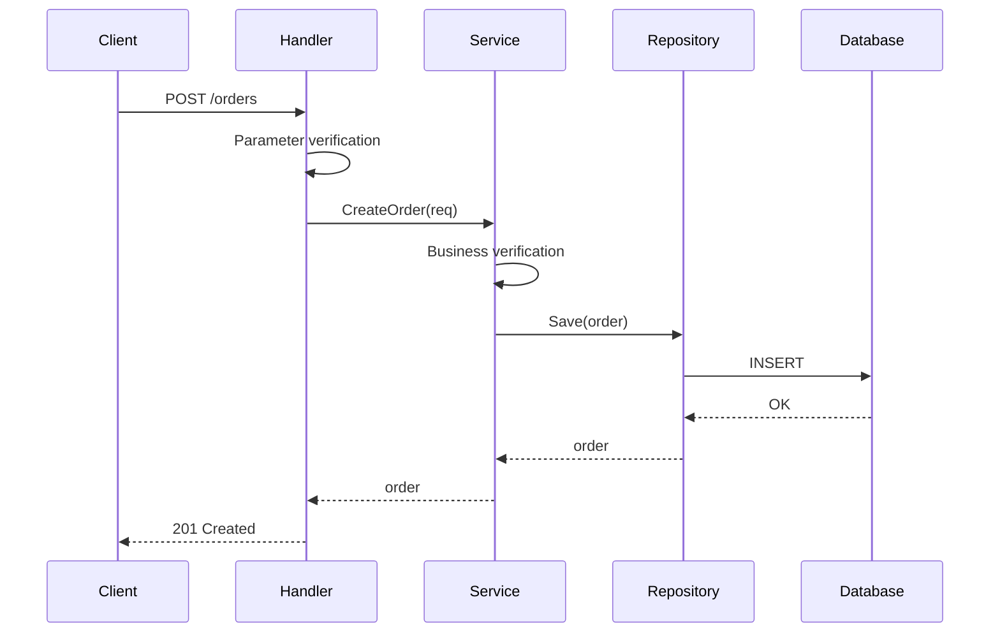
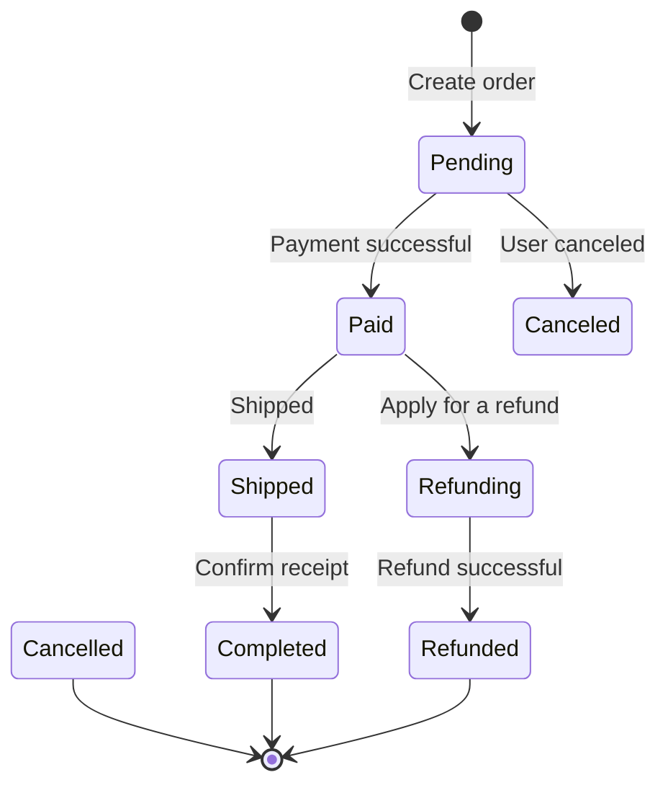

# LLD Document Template (Core)

> This template is the core chapter of LLD and all LLD must contain these contents. See `modules.md` for the Add-on module section.

---

## 1. Document Information

| Properties | Values ​​|
|------|-----|
| Document Name | LLD - {Module/Function Name} |
| Version | v1.0 |
| Author | {Author} |
| Creation Date | {YYYY-MM-DD} |
| PRD baseline | {PRD file path} v{version} |
| HLD baseline | {HLD file path} v{version} |
| Contract baseline | {Contract file path} |
| Guardrails | {Guardrails path} / None |
| Status | Draft / Under Review / Approved |

---

## 2. LLD Manifest

> Use the `lld-manifest.md` template to list the modules included in this LLD.

| Module | Included | N/A Reason | Evidence Location | Guardrails Requirements |
|------|----------|----------|----------|----------------|
| Core | Y | - | This document | Required |
| API Contract | {Y/N} | {Reason} | {§X.X} | {Is it mandatory} |
| Storage & Migration | {Y/N} | {Reason} | {§X.X} | {Is it mandatory} |
| ... | | | | |

---

## 3. Scope and Assumptions

### 3.1 In-Scope (covered by this LLD)

Clearly list the functions/modules covered by this LLD design:

- {Function/Module 1}
- {Function/Module 2}
- ...

### 3.2 Out-of-Scope (not covered by this LLD)

Explicitly list what is not within the scope of this LLD (to avoid ambiguity):

- {feature not covered 1} (reason: {covered by other LLD/subsequent iteration})
- ...

### 3.3 Key assumptions

List the assumptions that the design relies on. If the assumptions are not true, the design needs to be adjusted:

| # | Assumptions | Basis | Impact |
|---|------|------|------|
| 1 | {Assumption description} | {Source: HLD/PRD/User confirmation} | {Impact if not true} |

### 3.4 Dependencies

| Dependencies | Type | Status | Responsible Party |
|--------|------|------|--------|
| {Service/Module Name} | Internal Service / External API / Shared Library | Ready / Under Development | {Team} |

---

## 4. Module/package structure

### 4.1 Directory structure

```
{module-name}/
├── cmd/ # Entry/Startup
│   └── main.go
├── internal/ # Internal implementation (cannot be imported externally)
│ ├── handler/ # Request processing layer
│ ├── service/ # Business logic layer
│ ├── repository/ # Data access layer
│ └── model/ # Internal model
├── pkg/ # Exportable public package
│ └── dto/ # Data transfer object
├── config/ # Configuration
└── test/ # test
    ├── unit/
    └── integration/
```

> Adjust the directory structure according to the actual technology stack (such as `src/main/java` for Java and `src/` for Python)

### 4.2 Dependency graph



### 4.3 Package/Module Responsibilities

| Package/Module | Responsibilities | Dependencies |
|---------|------|------|
| `handler` | Request parsing, parameter verification, response encapsulation | `service` |
| `service` | Business logic orchestration | `repository`, `client` |
| `repository` | Data persistence | `model` |

---

## 5. Key interfaces and function signatures

### 5.1 Core interface definition

```go
// OrderService order service interface
type OrderService interface {
// CreateOrder creates an order
// Parameters: ctx - context, req - create request
// Return: order entity, error
    CreateOrder(ctx context.Context, req *CreateOrderRequest) (*Order, error)

// GetOrder query order
    GetOrder(ctx context.Context, orderID string) (*Order, error)

// CancelOrder cancels the order
    CancelOrder(ctx context.Context, orderID string, reason string) error
}
```

> Adjust the syntax to the actual language (TypeScript/Java/Python, etc.)

### 5.2 Key method signature

| method | input | output | description |
|------|------|------|------|
| `CreateOrder` | `CreateOrderRequest` | `Order, error` | Create a new order |
| `GetOrder` | `orderID: string` | `Order, error` | Query by ID |
| `CancelOrder` | `orderID, reason` | `error` | Cancel order |

### 5.3 Contract Mapping

> Reference the API Contract to explain the mapping relationship between interfaces and functions

| Contract interface | Function/method | Description |
|---------------|----------|------|
| `POST /api/v1/orders` | `OrderService.CreateOrder` | - |
| `GET /api/v1/orders/{id}` | `OrderService.GetOrder` | - |

---

## 6. Data structure and DTO

### 6.1 Core data structure

```go
// Order order entity (internal model)
type Order struct {
    ID          string       `json:"id"`
    UserID      string       `json:"user_id"`
    Items       []OrderItem  `json:"items"`
TotalAmount int64 `json:"total_amount"` // Unit: minutes
    Status      OrderStatus  `json:"status"`
    CreatedAt   time.Time    `json:"created_at"`
    UpdatedAt   time.Time    `json:"updated_at"`
}

// OrderStatus order status enumeration
type OrderStatus string
const (
    OrderStatusPending   OrderStatus = "pending"
    OrderStatusPaid      OrderStatus = "paid"
    OrderStatusCancelled OrderStatus = "cancelled"
)
```

### 6.2 DTO (Data Transfer Object)

```go
// CreateOrderRequest creates an order request
type CreateOrderRequest struct {
    UserID string      `json:"user_id" validate:"required"`
    Items  []ItemInput `json:"items" validate:"required,min=1"`
}

// CreateOrderResponse creates an order response
type CreateOrderResponse struct {
    OrderID string `json:"order_id"`
    Status  string `json:"status"`
}
```

### 6.3 Data conversion

| Source | Target | Conversion Method |
|------|------|----------|
| `CreateOrderRequest` | `Order` | `mapper.ToOrder()` |
| `Order` | `CreateOrderResponse` | `mapper.ToResponse()` |

---

## 7. Key process/pseudocode

### 7.1 Main process (Happy Path)



### 7.2 Key branch pseudocode

```python
def create_order(request):
# 1. Parameter verification
    if not validate(request):
        raise ValidationError("invalid request")

# 2. Business verification
    user = user_service.get_user(request.user_id)
    if not user.is_active:
        raise BusinessError("user not active")

# 3. Inventory Check
    for item in request.items:
        stock = inventory.check(item.product_id)
        if stock < item.quantity:
            raise BusinessError("insufficient stock")

# 4. Create order
    order = Order(
        id=generate_id(),
        user_id=request.user_id,
        items=request.items,
        status=OrderStatus.PENDING
    )

# 5. Persistence
    repository.save(order)

# 6. Send event (if any)
    event_bus.publish(OrderCreatedEvent(order))

    return order
```

### 7.3 State machine (if applicable)



---

## 8. Error handling and exception branching

### 8.1 Error classification

| Error type | Error code range | Processing strategy | HTTP status code |
|----------|-----------|----------|-------------|
| Parameter verification error | 1001-1099 | Return directly without retrying | 400 |
| Business rule error | 2001-2099 | Return directly without retrying | 422 |
| Resource does not exist | 3001-3099 | Return directly | 404 |
| System internal error | 5001-5099 | Record log, can retry | 500 |
| External dependency errors | 6001-6099 | Downgrade/retry/circuit break | 502/503 |

### 8.2 Error code definition

> Quote the error code in the Contract and supplement the internal error code

| Error code | Name | Description | Handling suggestions |
|--------|------|------|----------|
| `ORDER_1001` | `INVALID_PARAM` | Invalid request parameter | Check parameter format |
| `ORDER_2001` | `INSUFFICIENT_STOCK` | Insufficient stock | Reduce quantity or replace items |
| `ORDER_2002` | `USER_NOT_ACTIVE` | User is not activated | Contact customer service |

### 8.3 Exception handling process

```python
try:
    result = service.create_order(request)
except ValidationError as e:
    return error_response(400, e.code, e.message)
except BusinessError as e:
    return error_response(422, e.code, e.message)
except ExternalServiceError as e:
    logger.error(f"External service failed: {e}")
#Downgrade processing
    return fallback_response()
except Exception as e:
    logger.error(f"Unexpected error: {e}")
return error_response(500, "INTERNAL_ERROR", "Service internal error")
```

---

## 9. Concurrency/Transaction/Impotent

### 9.1 Concurrency model

| Scenario | Concurrency strategy | Implementation method |
|------|----------|----------|
| Order creation | Optimistic locking | Version number verification |
| Inventory deduction | Pessimistic lock | SELECT FOR UPDATE |
| Status Updates | CAS | Atomic Operations |

### 9.2 Transaction Boundaries

```python
@transactional
def create_order_with_stock_deduction(request):
# The following operations are in the same transaction
    order = create_order(request)
    deduct_stock(request.items)
    return order
```

| Operation combination | Transaction strategy | Rollback conditions |
|----------|----------|----------|
| Create order + deduct inventory | Same transaction | Any failure |
| Create order + send notification | Separate (eventually consistent) | Rollback if order fails, notification can be retried |

### 9.3 Idempotent design

| Interface | Idempotent keys | Idempotent strategies |
|------|--------|----------|
| Create order | `request_id` | Token anti-duplication (Redis SETNX) |
| Payment callback | `payment_id` | State machine idempotent (skip if already paid) |

```python
def create_order_idempotent(request_id, request):
# 1. Check idempotent keys
    if redis.exists(f"order:idempotent:{request_id}"):
        return get_existing_order(request_id)

# 2. Set idempotent key (with expiration time)
    redis.setex(f"order:idempotent:{request_id}", 3600, "processing")

# 3. Execute business logic
    order = create_order(request)

# 4. Update idempotent keys
    redis.setex(f"order:idempotent:{request_id}", 86400, order.id)

    return order
```

---

## 10. Configuration/Feature Flag

### 10.1 Configuration items

| Configuration items | Type | Default value | Description | Environment differences |
|--------|------|--------|------|----------|
| `order.max_items` | int | 100 | Maximum number of items in a single order | None |
| `order.timeout_minutes` | int | 30 | Unpaid order timeout | None |
| `db.pool_size` | int | 10 | Database connection pool size | dev:5, prod:20 |

### 10.2 Feature Flag

| Flag | Default value | Description | Grayscale strategy |
|------|--------|------|----------|
| `enable_new_pricing` | false | New pricing strategy | grayscale by user ID |
| `enable_async_notification` | true | Asynchronous notification | Full |

```python
if feature_flag.is_enabled("enable_new_pricing", user_id=user.id):
    price = new_pricing_service.calculate(items)
else:
    price = legacy_pricing_service.calculate(items)
```

---

## 11. Test design

### 11.1 Unit test scope

| Module | Test Focus | Coverage Goal |
|------|----------|-----------|
| `service` | Business logic branch | ≥ 80% |
| `repository` | CRUD operations | ≥ 70% |
| `handler` | Parameter verification, error handling | ≥ 70% |

### 11.2 Integration testing

| Test scenarios | Dependencies | Test methods |
|----------|------|----------|
| Complete order creation process | DB, MQ | TestContainer |
| Payment callback processing | Payment service Mock | WireMock |

### 11.3 Mock/Fixture strategy

| Dependencies | Mock methods | Description |
|------|----------|------|
| Database | TestContainer / SQLite | Real DB for integration testing |
| External API | WireMock / httptest | Simulate external service response |
| Message queue | Memory queue | Verify message sending |

### 11.4 Key test cases

| # | Test scenario | Input | Expected output |
|---|----------|------|----------|
| 1 | Order created normally | Valid request | Order created successfully |
| 2 | Out of stock | Quantity exceeded stock | Return out of stock error |
| 3 | User not activated | User ID not activated | User status error returned |
| 4 | Idempotent repeated request | Same request_id | Return existing order |

---

## 12. Traceability mapping

| Upstream entry | Source | LLD Chapter | Status |
|----------|------|----------|------|
| {PRD-001} Create Order Function | PRD | §5, §7 | ✅ Covered |
| {PRD-002} Order Status Management | PRD | §7.3 | ✅ Covered |
| {HLD-001} Order Service Architecture | HLD | §4 | ✅ Covered |
| {HLD-002} Cache Policy | HLD | §9 | ✅ Covered |
| `POST /api/v1/orders` | Contract | §5.3 | ✅ Covered |
| `GET /api/v1/orders/{id}` | Contract | §5.3 | ✅ Covered |

---

## 13. Questions to be confirmed

| # | Issue | Affected Chapters | Status | Person in Charge |
|---|------|----------|------|--------|
| 1 | {Problem description} | §X.X | To be confirmed | {Personnel} |

---

## 14. Change record

| Version | Date | Change content | Change person |
|------|------|----------|--------|
| v1.0 | {date} | initial release | {person} |
