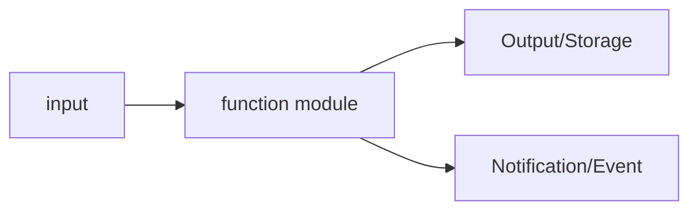
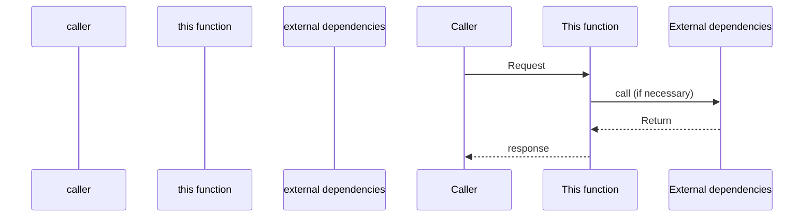

# PRD Template: new features (no UI/backend)

This template is suitable for new functional requirements that do not involve user interfaces, such as back-end services, APIs, and background tasks.

---

## Document structure

```markdown
# PRD: [function name]

> **Document Version**: X.X
> **Status**: Draft / Under Review / Approved
> **Author**: [Author’s name]
> **Creation Date**: YYYY-MM-DD
> **Last Update**: YYYY-MM-DD

<!-- TRACEABILITY-METADATA:BEGIN -->
```yaml
schema:
  name: testany-traceability
  version: "1.0.0"
  profile: prd-profile-v1
artifact:
  id: PRD-[DOMAIN]-001
  type: PRD
title: [function name]
  status: draft
  owners: []
  created_at: YYYY-MM-DD
  updated_at: YYYY-MM-DD
  source_documents: []
entities:
  requirements: []
  risks: []
  must_not_regress: []
  external_behaviors: []
  decisions: []
  flows: []
  test_cases: []
relations: []
waivers: []
```
<!-- TRACEABILITY-METADATA:END -->

---

## 1. Document Information

### 1.1 Basic Information

| Properties | Values ​​|
|------|-----|
| PRD Number | PRD-XXX |
| Products | [Product Name] |
| Priority | P0 / P1 / P2 / P3 |
| Estimated version | vX.X |
| PRD baseline version | vX.X (HLD is based on this version) |
| Last sync date | YYYY-MM-DD |

### 1.2 Revision History

| Version | Date | Changes | Author |
|------|------|----------|------|
| X.X | YYYY-MM-DD | [Change description] | [Author] |

### 1.3 Glossary

| Terminology | Definition |
|------|------|
| [Term] | [Definition] |

---

## 2. Background and goals

### 2.1 Business Background

[Describe business pain points or opportunities]

### 2.2 Product Goals

[Describe product goals]

### 2.3 Success Indicators

| Indicators | Target values ​​| Data sources | Measurement methods |
|------|--------|----------|----------|
| [Indicators] | [Target value] | Already buried points/Need to add new ones/Manual statistics | [Measurement method] |

### 2.4 Current Business State (such as adding new functions to existing systems)

#### Current process
[Describe how the current system handles related business. If it is a new function, it can be marked "not applicable"]

#### Business changes
| Change items | Before change | After change |
|--------|--------|--------|
| [Process/Function] | [Current Status] | [Target Status] |

#### Scope of influence
| Affected objects | Impact description |
|----------|----------|
| caller | [affected callers] |
| Existing Processes | [Affected Processes] |
| Upstream and downstream systems | [Affected systems] |

### 2.5 Relevant capability identification (mandatory)

| Existing capabilities | Capability scope | Matching degree with current needs | Capability gaps | Suggested directions | Source |
|----------|---------|--------------|---------|---------|------|
| [Capability name] | [Scope covered by this capability] | Complete match/Partial match/No match | [Gap description, fill in "None" if there is no gap] | Recommended reuse/Recommended expansion/Reference only/Need to create new | [Document/code path] |

> **Description**:
> - This table is a mandatory output to ensure that all potentially relevant existing capabilities are identified
> - **"Source" column is required**: You must indicate which document or code the capability was identified from, and no baseless guessing is allowed.
> - "Recommended directions" are only PRD suggestions, and the final reuse decision falls within the scope of HLD
> - If it is confirmed that there is no relevant ability, fill in "After investigation, there is no relevant ability" and explain the **scope of investigation** (which paths/keywords were searched)

---

## 3. Scope

### Within the scope of 3.1

- [Feature/Change 1]

### 3.2 Out of range

- [Items not within the scope]

### 3.3 Matters to be confirmed

- [ ] [Items to be confirmed]

---

## 4. System Overview

### 4.1 Function Overview

[Briefly describe the overall responsibilities and boundaries of the function]

### 4.2 Caller

| Caller | Calling scenario |
|--------|----------|
| [Caller] | [Scenario Description] |

### 4.3 Capability Overview

[Use Mermaid to describe the capabilities and data flow provided by the function]



> For specific technical architecture, see HLD

---

## 5. Functional Requirements

### 5.X [Function module name]

#### 5.X.1 Function Description

[Describe the functional purpose and business value of this module]

#### 5.X.2 Processing flow

[Describe business processes using Mermaid sequence diagrams or flowcharts]



#### 5.X.3 Business Rules

| Rule number | Rule description | Trigger conditions |
|----------|----------|----------|
| BR-001 | [Rule Description] | [Conditions] |

#### 5.X.4 Input and output

**enter**:
- [Describe what input data is required]

**Output**:
- [Describe what output is produced]

**side effect**:
- [Describe what side effects will occur, such as sending notifications, writing records, etc.]

---

## 6. Interface capabilities

[Describe the interface capabilities that need to be provided, without specifying specific paths and implementations]

### 6.X [Interface capability name]

| Properties | Description |
|------|------|
| Capability description | [What does this interface do] |
| Caller | [Who will call] |
| Certification Requirements | Required / Not Required |

#### Enter requirements

[Describe what input information is required]

- [Required input 1]
- [Required input 2]
- [optional input]

#### Output requirements

[Describe what information is returned]

- On success: [what to return]
- On failure: [What error message is returned]

#### Business constraints

- [Constraint 1]
- [Constraint 2]

> See HLD for specific API design

---

## 7. Data concepts

[Describe the business entities and relationships involved]

### 7.1 Business entity

| Entity | Description | Key Attributes |
|------|------|----------|
| [Entity Name] | [Business Meaning] | [Key Business Attributes] |

### 7.2 Entity Relationship

[Describe business relationships between entities]

```mermaid
erDiagram
Entity A ||--o{ Entity B : Relationship
```

> For specific data model design, see HLD

---

## 8. Non-functional requirements

### 8.1 Performance requirements

| Scenario | Metrics | Requirements |
|------|------|------|
| [Scenario] | Response time | P99 ≤ [X]ms |
| [Scenario] | Throughput | ≥ [X] QPS |

### 8.2 Reliability requirements

| Requirements | Goals |
|------|------|
| Availability | [X]% |
| Data persistence | [Description] |

### 8.3 Security requirements

| Requirements | Description |
|------|------|
| Certification | [Certification Requirements] |
| Authorization | [Authorization Requirements] |
| Data Protection | [Protection Requirements] |

### 8.4 Compatibility requirements

| Requirements | Description |
|------|------|
| Interface Compatibility | [Whether existing callers are affected] |
| Data Compatibility | [Whether existing data is affected] |
| Protocol Compatibility | [Whether the communication protocol has changed] |

### 8.5 Release requirements

| Requirements | Description |
|------|------|
| Grayscale strategy | [Whether grayscale is required, grayscale range] |
| Rollback capability | [Whether rollback needs to be supported] |
| Function switch | [Whether function switch is required] |

> Note: For specific grayscale/rollback technical solutions, see HLD

---

## 9. Dependencies and constraints

### 9.1 Known constraints

- [Business Constraints]
- [Time constraint]

### 9.2 External dependencies

- [Dependent third-party services]

> For details on technical dependencies, see HLD

---

## 10. Project Plan

### 10.1 Milestones

| Milestones | Target dates | Deliverables |
|--------|----------|--------|
| [Milestone] | YYYY-MM-DD | [Deliverable] |

### 10.2 Resource Allocation

| Roles | People | Commitment |
|------|------|------|
| [role] | [personnel] | [ratio] |

---

## 11. Risks and Mitigations

| Risk | Impact | Probability | Mitigation |
|------|------|------|----------|
| [Risk] | High/Medium/Low | High/Medium/Low | [Measures] |

---

## 12. Acceptance Criteria

### AC-001: [Acceptance item name]
- [ ] [Acceptance Conditions]

---

## 13. Questions to be clarified

| Number | Question | Asked by | Status | Conclusion |
|------|------|--------|------|------|
| Q1 | [Question] | [Asker] | To be discussed/resolved | [Conclusion] |

---

## Appendix

[If any additional content]
```

---

## Writing Guidance

### System Overview Chapter

1. **Function Overview**: A paragraph that clearly explains what this function does
2. **Caller**: Who will use this function and under what circumstances it will be used?
3. **Capability Overview**: Use a simple flow chart to illustrate input and output

### Functional Requirements chapter

Each functional module contains:

1. **Functional Description**: Business purpose and value
2. **Processing process**: business process, not technical implementation
3. **Business Rules**: Business logic constraints
4. **Input and Output**: What is needed, what is produced

### Interface capability chapter

**Note**: PRD only describes the interface "capabilities" and does not design specific APIs.

**Correct writing**:
```markdown
### Create order ability

| Properties | Description |
|------|------|
| Capability description | Create order based on shopping cart |
| Caller | Front-end shopping cart page |
| Authentication requirements | User login required |

#### Enter requirements
- Shopping cart product list
- Shipping address
- Payment method

#### Output requirements
- On success: Return order number
- On failure: Return the reason for failure
```

**Wrong writing (crossing the boundary to HLD)**:

    ### POST /api/v1/orders

| Properties | Values ​​|
    |------|-----|
| Method | POST |
| path | /api/v1/orders |

#### Request body
    {
      "cart_id": "string",
      "address_id": "string"
    }

### Data Concept Chapter

**Correct writing**:
```markdown
| Entity | Description | Key Attributes |
|------|------|----------|
| Order | User's purchase record | Order number, amount, status, order time |
| Line item | Products in the order | Product name, quantity, unit price |
```

**Wrong writing (crossing the boundary to HLD)**:
```markdown
| Fields | Types | Constraints |
|------|------|------|
| id | UUID | PRIMARY KEY |
| created_at | TIMESTAMP | NOT NULL |
```

### Business rules form

| Rule number | Rule description | Trigger conditions |
|----------|----------|----------|
| BR-001 | Users can only create 10 projects per day | Check when creating a project |
| BR-002 | Orders that are not paid for more than 30 minutes will be automatically canceled | Regular check |

### Example of acceptance criteria

```markdown
### AC-001: Create Order
- [ ] You can create an order when there are items in the shopping cart
- [ ] Prompt the user when inventory is low and refuse to create
- [ ] Return the order number after successful creation
- [ ] The order status is initially "pending payment"

### AC-002: Order timeout cancellation
- [ ] Orders not paid for 30 minutes will be automatically canceled
- [ ] Release inventory on cancellation
- [ ] Send cancellation notification (if notification channel is configured)
```
