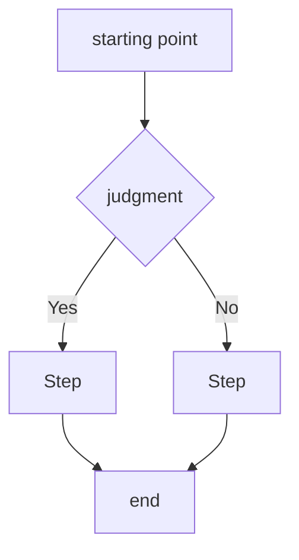

# PRD Template: new features (with UI)

This template is suitable for new functional requirements involving user interface.

---

## Document structure

```markdown
# PRD: [function name]

> **Document Version**: X.X
> **Status**: Draft / Under Review / Approved
> **Author**: [Author’s name]
> **Creation Date**: YYYY-MM-DD
> **Last Update**: YYYY-MM-DD

<!-- TRACEABILITY-METADATA:BEGIN -->
```yaml
schema:
  name: testany-traceability
  version: "1.0.0"
  profile: prd-profile-v1
artifact:
  id: PRD-[DOMAIN]-001
  type: PRD
title: [function name]
  status: draft
  owners: []
  created_at: YYYY-MM-DD
  updated_at: YYYY-MM-DD
  source_documents: []
entities:
  requirements: []
  risks: []
  must_not_regress: []
  external_behaviors: []
  decisions: []
  flows: []
  test_cases: []
relations: []
waivers: []
```
<!-- TRACEABILITY-METADATA:END -->

---

## 1. Document Information

### 1.1 Basic Information

| Properties | Values ​​|
|------|-----|
| PRD Number | PRD-XXX |
| Products | [Product Name] |
| Priority | P0 / P1 / P2 / P3 |
| Estimated version | vX.X |
| PRD baseline version | vX.X (HLD is based on this version) |
| Last sync date | YYYY-MM-DD |

### 1.2 Revision History

| Version | Date | Changes | Author |
|------|------|----------|------|
| X.X | YYYY-MM-DD | [Change description] | [Author] |

### 1.3 Glossary

| Terminology | Definition |
|------|------|
| [Term] | [Definition] |

---

## 2. Background and goals

### 2.1 Business Background

[Describe business pain points or opportunities]

### 2.2 Product Goals

[Describe product goals and what value users can gain]

### 2.3 Success Indicators

| Indicators | Target values ​​| Data sources | Measurement methods |
|------|--------|----------|----------|
| [Indicators] | [Target value] | Already buried points/Need to add new ones/Manual statistics | [Measurement method] |

### 2.4 Current Business State (such as adding new functions to existing systems)

#### Current process
[Describe how the current user completes related tasks. If it is a new function, it can be marked "not applicable"]

#### Business changes
| Change items | Before change | After change |
|--------|--------|--------|
| [Process/Function] | [Current Status] | [Target Status] |

#### Scope of influence
| Affected objects | Impact description |
|----------|----------|
| User Groups | [Affected Users] |
| Existing Processes | [Affected Processes] |
| Upstream and downstream systems | [Affected systems] |

### 2.5 Relevant capability identification (mandatory)

| Existing capabilities | Capability scope | Matching degree with current needs | Capability gaps | Suggested directions | Source |
|----------|---------|--------------|---------|---------|------|
| [Capability name] | [Scope covered by this capability] | Complete match/Partial match/No match | [Gap description, fill in "None" if there is no gap] | Recommended reuse/Recommended expansion/Reference only/Need to create new | [Document/code path] |

> **Description**:
> - This table is a mandatory output to ensure that all potentially relevant existing capabilities are identified
> - **"Source" column is required**: You must indicate which document or code the capability was identified from, and no baseless guessing is allowed.
> - "Recommended directions" are only PRD suggestions, and the final reuse decision falls within the scope of HLD
> - If it is confirmed that there is no relevant ability, fill in "After investigation, there is no relevant ability" and explain the **scope of investigation** (which paths/keywords were searched)

---

## 3. Scope

### Within the scope of 3.1

- [Feature/Change 1]
- [Feature/Change 2]

### 3.2 Out of range

- [Items not within the scope]

### 3.3 Matters to be confirmed

- [ ] [Items to be confirmed]

---

## 4. User Journey

### 4.1 Target users

[Describe target user profile]

### 4.2 Preconditions

| Conditions | Description |
|------|------|
| [Conditions] | [Description] |

### 4.3 Main process

[Described using Mermaid flowchart]



### 4.4 Exception process

| Abnormal scenarios | Handling methods |
|----------|----------|
| [Scenario] | [Processing method] |

---

## 5. Functional Requirements

### 5.X [Module/Page Name]

#### 5.X.1 Function Description

[Describe the functionality of this module]

#### 5.X.2 UI layout

[Use ASCII diagram or explain the location of the design draft]

```
┌─────────────────────────────────────────────────────────────┐
│ Page title │
├─────────────────────────────────────────────────────────────┤
│                                                             │
│    ┌─────────────────────────────────────────────────┐     │
│ │ [Component area] │ │
│ │ [Element Description] │ │
│ │ [Button] │ │
│    └─────────────────────────────────────────────────┘     │
│                                                             │
└─────────────────────────────────────────────────────────────┘
```

#### 5.X.3 Interaction Specifications

| Element | Interaction | Result |
|------|------|------|
| [element] | [interaction method] | [expected result] |

#### 5.X.4 Status Description

| Status | Conditions | UI Behavior |
|------|------|---------|
| [Status] | [Trigger Condition] | [Display Content] |

#### 5.X.5 Data Display

| Field | Description | Format |
|------|------|------|
| [Field] | [Business Meaning] | [Display Format] |

---

## 6. Data concept

[Describe the business entities and relationships involved, conceptual level only]

### 6.1 Business entity

| Entity | Description | Key Attributes |
|------|------|----------|
| [Entity name] | [Business meaning] | [Key business attributes, non-technical fields] |

### 6.2 Entity Relationship

[Use brief text or Mermaid ER diagram to describe the business relationships between entities]

```mermaid
erDiagram
User ||--o{ Order : Create
Order ||--|{ Line Item : Contains
```

> For specific data model design, see HLD

---

## 7. Non-functional requirements

### 7.1 Performance requirements

| Scenario | Requirements |
|------|------|
| Page Loading | [Requirements] |
| Operation response | [request] |

### 7.2 Compatibility requirements

| Platform/Browser | Minimum version |
|-------------|----------|
| [Platform] | [Version] |

### 7.3 Backward compatibility requirements

| Requirements | Description |
|------|------|
| Old version client | [Whether compatibility is required and how to be compatible] |
| Existing data | [Whether existing data is affected] |
| Existing process | [Whether the existing user process is retained] |

### 7.4 Release requirements

| Requirements | Description |
|------|------|
| Grayscale strategy | [Whether grayscale is required, grayscale range] |
| Rollback capability | [Whether rollback needs to be supported] |
| Function switch | [Whether function switch is required] |

> Note: For specific grayscale/rollback technical solutions, see HLD

### 7.5 Accessibility Requirements

[if applicable]

---

## 8. Dependencies and constraints

### 8.1 Known constraints

- [Business Constraints]
- [Time constraint]
- [Resource Constraints]

### 8.2 External dependencies

- [Third-party services or products relied upon]

> For details on technical dependencies, see HLD

---

## 9. Project Plan

### 9.1 Milestones

| Milestones | Target dates | Deliverables |
|--------|----------|--------|
| [Milestone] | YYYY-MM-DD | [Deliverable] |

### 9.2 Resource Allocation

| Roles | People | Commitment |
|------|------|------|
| [role] | [personnel] | [ratio] |

---

## 10. Risks and Mitigations

| Risk | Impact | Probability | Mitigation |
|------|------|------|----------|
| [Risk] | High/Medium/Low | High/Medium/Low | [Measures] |

---

## 11. Acceptance Criteria

### AC-001: [Acceptance item name]
- [ ] [Acceptance Condition 1]
- [ ] [Acceptance Condition 2]

### UX-001: [User Experience Acceptance Item]
- [ ] [Acceptance Conditions]

---

## 12. Questions to be clarified

| Number | Question | Asked by | Status | Conclusion |
|------|------|--------|------|------|
| Q1 | [Question] | [Asker] | To be discussed/resolved | [Conclusion] |

---

## Appendix

[If any additional content]
```

---

## Writing Guidance

### User Journey Chapter

1. **Target User**: Describe user portrait, including role, technical level, and usage scenarios
2. **Preconditions**: Conditions that need to be met before the user enters the process
3. **Main process**: Use Mermaid flow chart to describe it, focusing on the user perspective rather than the system perspective
4. **Exception process**: List possible exception situations and handling methods

### Functional Requirements chapter

Each page/module contains:

1. **Function Description**: Briefly describe the purpose of the function
2. **UI Layout**: Use ASCII diagrams to describe the page structure, or indicate the location of the design draft
3. **Interaction specification**: A table describing the behavior of each interactive element
4. **Status Description**: Different states and triggering conditions of the page/component
5. **Data display**: What data is displayed and what is the format?

### Data Concept Chapter

**Note**: PRD only describes business concepts and does not specify technical implementation.

**Correct writing**:
```markdown
| Entity | Description | Key Attributes |
|------|------|----------|
| Order | User's purchase record | Order number, amount, status, order time |
| Line item | Products in the order | Product name, quantity, unit price |
```

**Wrong writing (crossing the boundary to HLD)**:
```markdown
| Fields | Types | Constraints |
|------|------|------|
| id | UUID | PRIMARY KEY |
| created_at | TIMESTAMP | NOT NULL |
```

### UI layout ASCII diagram specification

```
┌────────────┐ - Page/Area Border
│           │
├────────────┤ - Divider
│           │
└───────────┘

[button] - clickable element
"Input box" - input element
○ Radio - radio button
☑ Check - Checkbox
▼ Drop-down menu
```

### Interactive specification form

| Element | Interaction | Result |
|------|------|------|
| Submit button | Click | Verify the form, submit and display a success prompt if successful |
| Cancel button | Click | Close pop-up window without saving data |
| Input box | Input | Real-time verification, display red border and prompt when error occurs |
| List item | Click | Jump to details page |
| List item | Long press | Show operation menu |

### Example of acceptance criteria

```markdown
### AC-001: User login
- [ ] Enter the correct username and password, click login, and successfully enter the homepage
- [ ] If you enter an incorrect password, a "wrong username or password" prompt will be displayed.
- [ ] If you enter incorrectly 5 times in a row, your account will be locked for 15 minutes.
- [ ] Login status remains for 7 days (unless you actively log out)

### UX-001: Login page experience
- [ ] Page load time ≤ 2 seconds
- [ ] supports keyboard Tab switching focus
- [ ] Password input box supports show/hide switching
```
