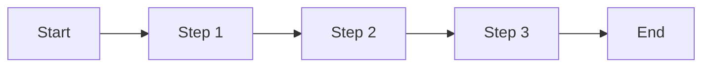

# User Journey Documentation

## Document Information

| Properties | Values ​​|
|------|-----|
| Document Name | User Journeys - {Project Name} |
| Version | v1.0 |
| Creation Date | {YYYY-MM-DD} |
| BRD source | {BRD file path} |
| Status | Aligned / Pending Review |

---

## Overview

### Business Background
{Business Background summary extracted from BRD}

### Target users
{Target user persona extracted from BRD}

### Journey range

| Journey | Priority | Status |
|---------|--------|------|
| {Journey 1} | P0 | Confirmed |
| {Journey 2} | P1 | Confirmed |
| {Journey 3} | P2 | To be followed |

---

## Journey Graph (jump across journeys)

| From Journey/Step | Trigger | To Journey/Step | Type | Description |
|------------------|---------|----------------|------|------|
| {Journey 1 / S2} | {Condition} | {Journey 2 / S1} | Jump | {Data handover} |
| {Journey 1 / S3} | {Condition} | END | End | {End Description} |

---

## Journey 1: {Journey name}

### Basic Information

| Properties | Description |
|------|------|
| Priority | P0 / P1 / P2 |
| User | {The type of user who performed this operation} |
| Goal | {What the user wants to accomplish} |
| Entry condition/source | {from which journey/entry condition} |
| end status | {status after process completion} |
| Main exit/jump point | {Jump target or end condition} |

### Step node (default path)

| Step ID | User action | Response seen by the user | Notes |
|------|----------|----------|------|
| S1 | {What the user does} | {What the user sees} | {Additional explanation} |
| S2 | {What the user does} | {What the user sees} | {Additional instructions} |
| S3 | {What the user does} | {What the user sees} | {Additional instructions} |

### Jump/branch (Journey Graph edge)

| From Step | Trigger | To Journey/Step | Type | Description |
|-----------|---------|----------------|------|------|
| {S1} | {Condition} | {Journey 2 / S1} | Jump | {Data handover} |
| {S3} | {Condition} | END | End | {End Description} |

###Exception handling

| Abnormal situations | Trigger conditions | Handling methods | What users see |
|----------|----------|----------|--------------|
| {Exception 1} | {Condition} | Block/Warn/Downgrade | {Message} |
| {Exception 2} | {Condition} | Block/Warn/Downgrade | {Message} |

### Boundary cases

| Boundary cases | Handling | Priority |
|----------|----------|--------|
| {Boundary 1: Empty data} | {Processing} | MVP / Follow-up |
| {Boundary 2: Such as large data volume} | {Processing} | MVP / Follow-up |

### Pending items

- [ ] {Question to be confirmed 1}
- [ ] {Question to be confirmed 2}

---

## Journey 2: {Journey name}

{Using the same structure as Journey 1}

---

## Consistency across Journey

### Sharing steps

| Share Steps | Appears in | Unified Behavior |
|----------|--------|----------|
| {Step Name} | Journey 1, Journey 2 | {Consistent Behavior Description} |

### Unified exception handling

| Exception type | Unified processing method | Unified prompt information |
|----------|--------------|--------------|
| Network error | {Processing} | {Prompt} |
| Insufficient permissions | {Process} | {Prompt} |
| Session Expiration | {Processing} | {Prompt} |

---

## Traceback mapping

### BRD → Journey mapping

| BRD requirement items | Corresponding Journey | Coverage status | Remarks |
|------------|--------------|----------|------|
| {BRD-001} | Journey 1 | Covered | |
| {BRD-002} | Journey 1, 2 | Covered | |
| {BRD-003} | - | To be followed | P2 priority |

### Journey → PRD placeholder

| Journey | PRD Requirement ID | Status |
|---------|-------------|------|
| Journey 1 | To be assigned | - |
| Journey 2 | To be assigned | - |

---

## Change record

| Version | Date | Change content | Change person |
|------|------|----------|--------|
| v1.0 | {date} | initial release | {person} |
