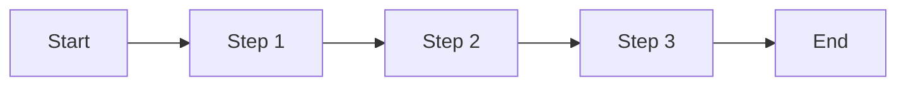

<!-- TRACEABILITY-METADATA:BEGIN -->
```yaml
schema:
  name: testany-traceability
  version: "1.0.0"
  profile: journey-profile-v1
artifact:
  id: JOURNEY-{PROJECT_KEY}-001
  type: USER_JOURNEY
  title: User Journeys - {Project Name}
  status: draft
  owners:
    - {owner.team}
  created_at: {YYYY-MM-DD}
  updated_at: {YYYY-MM-DD}
  source_documents:
    - {BRD-ARTIFACT-ID}
entities:
  requirements: []
  risks: []
  must_not_regress: []
  external_behaviors: []
  decisions: []
  flows:
    - id: FLOW-{PROJECT_KEY}-001
      title: {Journey 1 Title}
      statement: {One-line description of the user goal and outcome for Journey 1}
      status: approved
      scope: in
      kind: user_journey
      priority: P0
      source_refs:
        - artifact_id: {BRD-ARTIFACT-ID}
          section: {BRD section}
    - id: FLOW-{PROJECT_KEY}-002
      title: {Journey 2 Title}
      statement: {One-line description of the user goal and outcome for Journey 2}
      status: proposed
      scope: in
      kind: user_journey
      priority: P1
      source_refs:
        - artifact_id: {BRD-ARTIFACT-ID}
          section: {BRD section}
  test_cases: []
relations:
  - id: REL-{PROJECT_KEY}-001
    type: derived_from
    from: FLOW-{PROJECT_KEY}-001
    to: {BRD-ARTIFACT-ID}
    status: active
  - id: REL-{PROJECT_KEY}-002
    type: derived_from
    from: FLOW-{PROJECT_KEY}-002
    to: {BRD-ARTIFACT-ID}
    status: active
  - id: REL-{PROJECT_KEY}-003
    type: depends_on
    from: FLOW-{PROJECT_KEY}-001
    to: FLOW-{PROJECT_KEY}-002
    status: active
waivers: []
```
<!-- TRACEABILITY-METADATA:END -->

# User Journey Document

## Document Information

| Field | Value |
|------|-------|
| Document Name | User Journeys - {Project Name} |
| Document ID | JOURNEY-{PROJECT_KEY}-001 |
| Version | v1.0 |
| Created At | {YYYY-MM-DD} |
| BRD Baseline Artifact ID | {BRD-ARTIFACT-ID} |
| BRD Baseline Confirmed | Yes / No |
| Checkpoint Status | draft / in_review / approved |
| trace-lint Result | pass / fail |
| Blocking Issues | None / {Issue list} |

---

## Overview

### Business Background
{Business background summary extracted from the BRD}

### Target Users
{Target user persona extracted from the BRD}

### Journey Scope

| Journey ID | Journey | Priority | Status | BRD Source |
|------------|---------|----------|--------|------------|
| FLOW-{PROJECT_KEY}-001 | {Journey 1} | P0 | Confirmed | {BRD section} |
| FLOW-{PROJECT_KEY}-002 | {Journey 2} | P1 | Confirmed / Pending | {BRD section} |

---

## Journey Graph

| From Journey/Step | Trigger | To Journey/Step | Type | Notes |
|------------------|---------|----------------|------|------|
| {Journey 1 / S2} | {Condition} | {Journey 2 / S1} | Jump | {Data handoff} |
| {Journey 1 / S3} | {Condition} | END | End | {Exit description} |

---

## Journey 1: {Journey Name}

### Basic Information

| Field | Description |
|------|-------------|
| Journey ID | FLOW-{PROJECT_KEY}-001 |
| Priority | P0 / P1 / P2 |
| User | {User type} |
| Goal | {What the user wants to achieve} |
| Reason | {Why the user needs this flow} |
| Entry Condition / Source | {Upstream journey or entry condition} |
| End State | {Outcome after completion} |
| Main Exit / Jump Point | {Jump target or end condition} |

### Step Nodes (Default Path)



| Step ID | User Action | User-Visible Response | Related Edge Cases | Notes |
|------|-------------|-----------------------|--------------------|------|
| S1 | {What the user does} | {What the user sees} | {EC-001 / -} | {Notes} |
| S2 | {What the user does} | {What the user sees} | {EC-001, EC-002} | {Notes} |
| S3 | {What the user does} | {What the user sees} | {EC-003 / -} | {Notes} |

### Jump / Branch Table

| From Step | Trigger | To Journey/Step | Type | Notes |
|-----------|---------|----------------|------|------|
| {S1} | {Condition} | {Journey 2 / S1} | Jump | {Data handoff} |
| {S3} | {Condition} | END | End | {Exit description} |

### Exception Handling

| Exception | Trigger | Handling | What the User Sees |
|-----------|---------|----------|--------------------|
| {Exception 1} | {Condition} | Block / Warn / Degrade | {Message} |
| {Exception 2} | {Condition} | Block / Warn / Degrade | {Message} |

### Edge Case Matrix

| Edge Case ID | Category | Applicable Step | Trigger | What the User Sees | Outcome / Flow | Data Retention / Recovery | Priority | Status |
|--------------|----------|-----------------|---------|--------------------|----------------|---------------------------|----------|--------|
| EC-001 | Data availability / shape | S2 | {Condition} | {Empty state / prompt} | {Stay / redirect} | {Retention / recovery rule} | MVP / Later | Confirmed / Pending |
| EC-002 | Repeated / high-frequency action | S3 | {Condition} | {Button state / warning} | {Stay / end} | {Retention / recovery rule} | MVP / Later | Confirmed / Pending |

### Pending Items

- [ ] {Question to be confirmed 1}
- [ ] {Question to be confirmed 2}

---

## Journey 2: {Journey Name}

{Use the same structure as Journey 1}

---

## Cross-Journey Consistency

### Shared Steps

| Shared Step | Appears In | Unified Behavior |
|-------------|------------|------------------|
| {Step Name} | Journey 1, Journey 2 | {Consistent behavior} |

### Unified Exception / Edge Case Handling

| Type | Unified Handling | Data Retention / Recovery | Notes |
|------|------------------|---------------------------|------|
| Network error | {Handling} | {Recovery} | {Notes} |
| Permission denied | {Handling} | {Recovery} | {Notes} |
| Session expired | {Handling} | {Recovery} | {Notes} |

---

## Traceability Mapping

### BRD -> Journey Mapping

| BRD Item | Covered by Journey | Coverage Status | Notes |
|----------|--------------------|-----------------|------|
| {BRD-001} | FLOW-{PROJECT_KEY}-001 | Covered | |
| {BRD-002} | FLOW-{PROJECT_KEY}-001, FLOW-{PROJECT_KEY}-002 | Covered | |
| {BRD-003} | - | Later | P2 priority |

### Journey -> PRD Placeholder

| Journey ID | Journey | PRD Requirement ID | Status |
|------------|---------|--------------------|--------|
| FLOW-{PROJECT_KEY}-001 | {Journey 1} | TBD | - |
| FLOW-{PROJECT_KEY}-002 | {Journey 2} | TBD | - |

---

## Checkpoint Decision

| Check | Result | Notes |
|-------|--------|------|
| Latest approved BRD baseline confirmed | Yes / No | {Notes} |
| BRD in-scope items mapped | Yes / No | {Notes} |
| All P0 journeys confirmed | Yes / No | {Notes} |
| No dangling jumps / undefined entries | Yes / No | {Notes} |
| No pending MVP edge cases | Yes / No | {Notes} |
| trace-lint passed | Yes / No | {Notes} |
| Final Status | draft / in_review / approved | {Decision rationale} |

### Review Record

| Role / Reviewer | Decision | Date | Notes |
|-----------------|----------|------|------|
| {PM / Stakeholder} | Approve / Needs changes | {YYYY-MM-DD} | {Notes} |
| {Design / Product} | Approve / Needs changes | {YYYY-MM-DD} | {Notes} |

---

## Change Log

| Version | Date | Change | Author |
|---------|------|--------|--------|
| v1.0 | {Date} | Initial version | {Name} |
